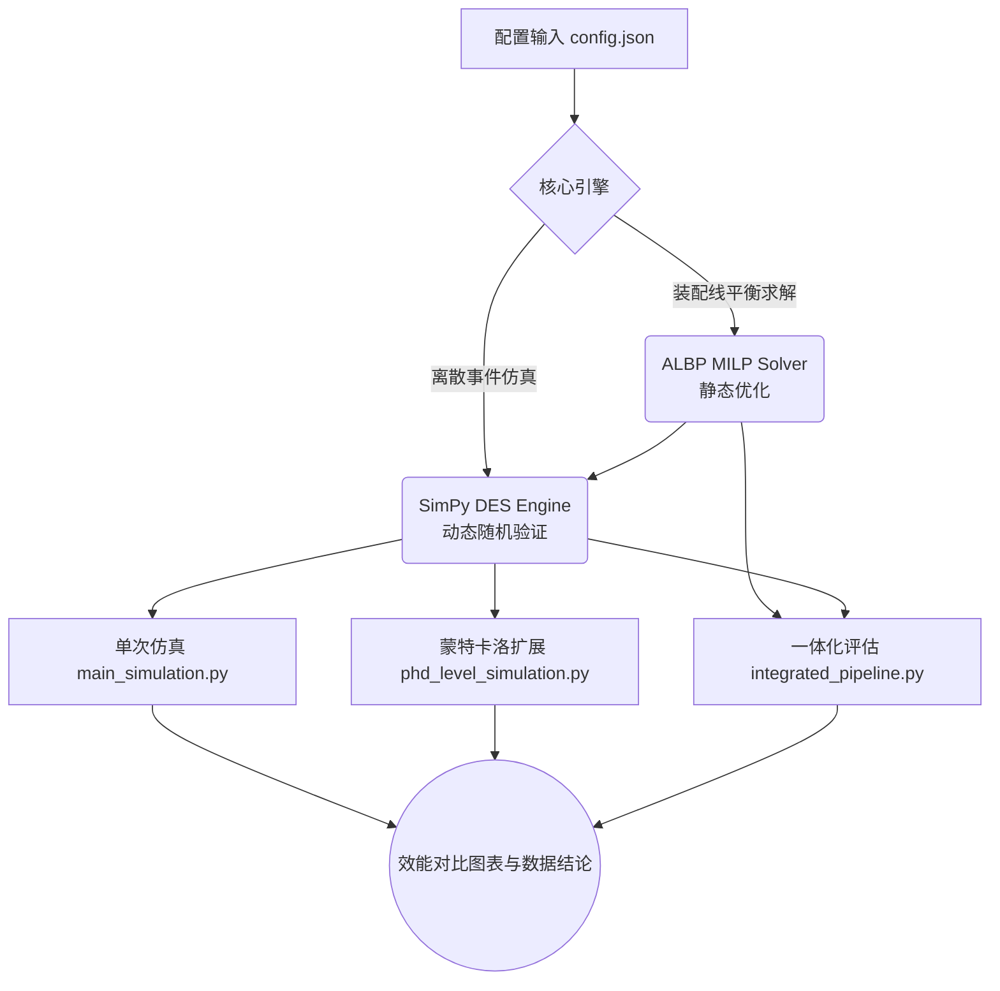

# 袜业生产线精益优化与离散事件仿真项目 (Socks Production Simulation)

本项目以 Python 的离散事件仿真库 `SimPy` 演示五工序生产线的参数化情景比较。没有提供可核验的现场测时或生产记录，模型输出不是企业实绩，也不是经过校准的数字孪生。

### 📊 核心架构与仿真逻辑



## 目录结构
- `main_simulation.py`: 核心仿真代码，包含了流水线类 `HosieryLine` 以及改善前后的环境配置。
- `phd_level_simulation.py`: 多次随机情景仿真，输出逐次数据 `phd_simulation_replications.csv` 与摘要图 `phd_analysis_dashboard.png`。
- `albp_milp_solver.py`: 装配线平衡问题（ALBP）的混合整数线性规划（MILP）求解器。
- `integrated_pipeline.py`: 一体化示例——MILP 静态求解 → DES 随机情景仿真 → 简化成本评价，读取 `config.json`。当前模型未实现工位并行工序时长叠加、固定随机种子或逐次结果导出，经济指标依赖示例假设，不应当作经验证的投资收益结论。
- `config.json`: 工序、目标工位周期时间、先后约束、仿真规模与财务参数。
- `requirements.txt`: 运行仿真所需的 Python 依赖库。
- `simulation_comparison.png` / `phd_analysis_dashboard.png`: 运行仿真后自动生成的效能对比图表。

## 仿真逻辑说明
本项目模拟了一个标准 8 小时（28,800秒）工作班次内的生产情况。

### 1. 优化前（Before Optimization）
- **模式**：孤岛式作业，各工序间缺乏协同。
- **瓶颈工序时间**：缝头情景参数为 6 秒/双；这是模型输入，不代表现场测时或需求节拍。
- **系统表现**：8 小时仿真班次的完成产量受 6 秒缝头瓶颈限制；按五个仿真工序计算的理论线平衡率（LBR）为 **47.3%**。该公式不包含织造上游及物流等待等系统边界外活动。

### 2. 优化后（After Optimization）
- **模式**：参数化优化情景，设置各工序较短的服务时间；当前代码未模拟 U 型布局、自动化设备或多能工机制。
- **周期时间重组**：瓶颈工序配置为 1.25 秒/双，各道工序服务时间为（缝头 1.18s，整理 1.11s，定型 1.14s，打签 1.03s，包装 1.25s）。此为模型输入，不应与需求侧节拍（Takt Time）混称。
- **系统表现**：8 小时仿真班次的完成产量由到达过程、工序服务和班次末在制品共同决定；按五个仿真工序计算的理论 LBR 为 **91.4%**。具体班次产量以脚本当次固定种子输出为准，不称为日产能或实测产能。

## 如何运行
1. 安装依赖包（含运行 MILP 所需的 `pulp`）：
   ```bash
   pip install -r requirements.txt
   ```
2. 运行仿真脚本：
   ```bash
   python main_simulation.py
   ```
3. 查看控制台输出结果以及生成的对比图表 `simulation_comparison.png`。结果代表一个固定随机种子的单次 8 小时情景仿真，受模型假设影响，不应直接外推为工厂实绩或统计显著结论。
4. 运行扩展蒙特卡洛试验并保存每次重复的原始数据：
   ```bash
   python phd_level_simulation.py
   ```
   输出 `phd_simulation_replications.csv` 与 `phd_analysis_dashboard.png`；报告需以 CSV 中 30 次重复结果重算描述统计与 Welch t 检验。脚本的服务时间和到达间隔使用下限裁切的正态抽样，CV 是裁切前输入参数，并非裁切后的实际 CV；两个情景顺序运行同一伪随机流，并非配对随机数设计。

## 扩展模块
- 一体化闭环评估（MILP + DES + 成本）：
  ```bash
  python integrated_pipeline.py
  ```
- 仅求解装配线平衡规划模型：
  ```bash
  python albp_milp_solver.py
  ```
